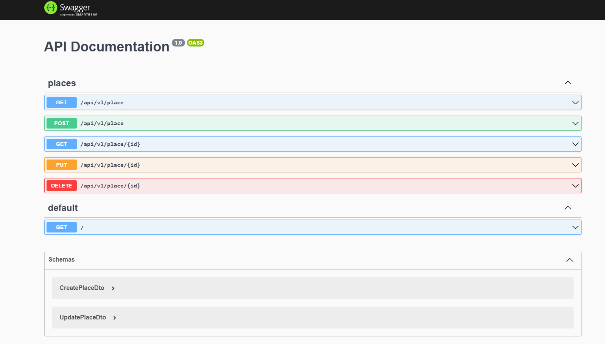

# Steps to run project

### Run the command bellow to run project:

```
make init
```

### When the project is running, open the API documentation to test the endpoints. 

- **URL default (depends of the port configured): http://localhost:3008/docs**



### To execute the unit tests, run the command bellow:

```
make cov
```
